## Why I design One Ciphertext for the Whole Board?

* The board is packed into a **64-bit bitmap** → only **1 ciphertext** stored on-chain.
* Gas efficient, simpler verification, less storage.

### Why `euint64`?

Refer: `contract/contracts/ConfidentialBomb.sol`

* Each bit = one tile (bomb or safe).
* Fits perfectly in **64 tiles max**.
* Uses `euint64` type in FHEVM for efficient encrypted computation.

### Why Web Worker for Encryption?

* FHE encryption is CPU-heavy.
* Done in a **Web Worker** to keep the UI responsive (progress bars, animations).
* Main thread stays free for React rendering.


## Gameplay Flow

1. **Start Game**

   * Browser generates board + seed.
   * Board packed → encrypted in worker.
   * Contract stores ciphertext + commit hash.

2. **Pick a Tile**

   * Player clicks a tile.
   * Contract extracts bit from ciphertext (`>>` + `&`).
   * Encrypted result tells if it’s safe or bomb.

3. **Game Ends**

   * 💥 Bomb → Game Over.
   * 🏆 Clear all safe tiles → Win.

4. **Verify**

   * Anyone fetches ciphertext via backend.
   * Decrypts with SDK → confirms fairness vs commit hash.

---

## 🛠️ Code Samples

### Frontend Encryption (Web Worker)

```js
/* eslint-disable no-undef */
importScripts("/fhevm-worker.js");

let fhevm = null;

self.onmessage = async (e) => {
  const { packedValue, contractAddress, userAddress, sdkConfig } = e.data;

  try {
    // Detect global SDK object
    const PossibleSDK =
      self.RelayerSDK || self.relayerSDK || self.fhevm || self.FHE || self.Zama || null;

    if (!PossibleSDK) throw new Error("FHE SDK global not found in worker");

    // Init FHEVM instance (only once)
    if (!fhevm) {
      let instanceCreator;
      if (typeof PossibleSDK === "function") {
        const maybeNeedsInit = new PossibleSDK();
        if (typeof maybeNeedsInit.initSDK === "function") await maybeNeedsInit.initSDK();
        instanceCreator = maybeNeedsInit;
      } else {
        instanceCreator = PossibleSDK;
        if (typeof instanceCreator.initSDK === "function") await instanceCreator.initSDK();
      }
      fhevm = await instanceCreator.createInstance(sdkConfig);
    }

    // Build encrypted input
    const buf = fhevm.createEncryptedInput(contractAddress, userAddress);
    buf.add64(BigInt(packedValue)); // pack board into euint64
    const result = await buf.encrypt();

    // Send ciphertext + inputProof back
    self.postMessage({
      encryptedBoard: result.handles[0],
      inputProof: result.inputProof,
    });
  } catch (err) {
    self.postMessage({ error: err?.message || String(err) });
  }
};
```

---

### Smart Contract: `createGame`

```solidity
function createGame(
    externalEuint64 encryptedBoard,
    bytes calldata proof,
    bytes32 commitHash,
    uint8 boardSize
) external returns (uint256 gameId) {
    require(boardSize > 0 && boardSize <= 64, "Board size must be 1-64");
    require(commitHash != bytes32(0), "Empty commit");

    // Import ciphertext from external proof
    euint64 board = FHE.fromExternal(encryptedBoard, proof);

    // Authorize computations + later decryptions
    FHE.allowThis(board);          // contract can compute on ciphertext
    FHE.allow(board, msg.sender);  // player can decrypt results

    // Save game
    gameId = ++gameCounter;
    games[gameId] = Game({
        player: msg.sender,
        boardSize: boardSize,
        encryptedBoard: board,
        commitHash: commitHash,
        openedCount: 0,
        state: State.Active
    });

    _openedMask[gameId] = 0;
    emit GameCreated(gameId, msg.sender, boardSize, commitHash);
}
```

---

## Visual Flow

```mermaid
graph TD;
    A[Pack Board] --> B[Encrypt in Worker]
    B --> C[Send 1 ciphertext + proof + commitHash to contract]
    C --> D[Store encryptedBoard on-chain]
    D --> E[Player picks tile]
    E --> F[Contract extracts bit from euint64]
    F -->|Bomb| G[💥 Game Over]
    F -->|Safe| H[Continue playing]
    H -->|All safe cleared| I[🏆 Win]
    G --> J[Verify possible]
    I --> J
    J --> K[Fetch ciphertext → Decrypt → Confirm commitHash]
```

