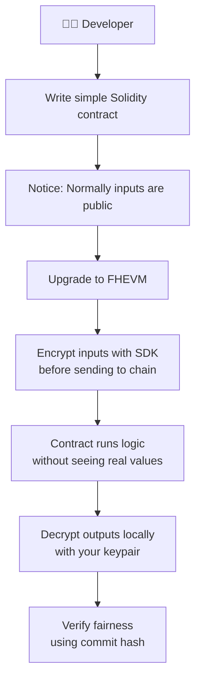
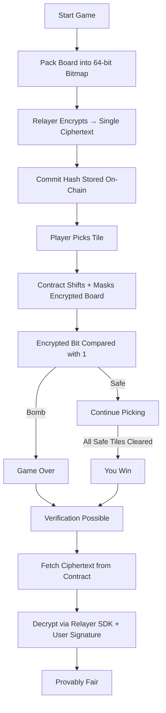
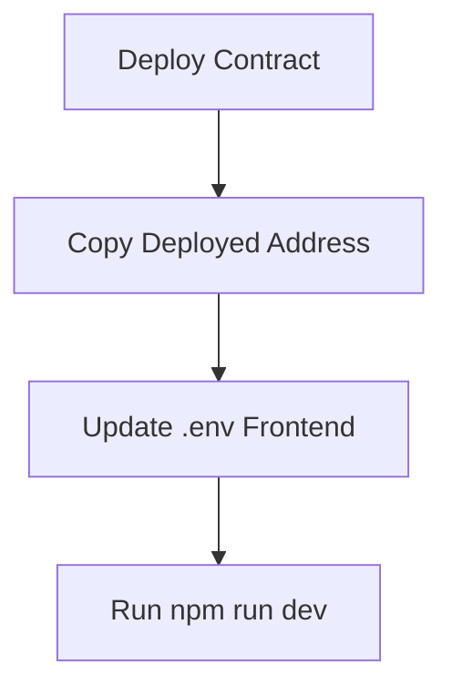
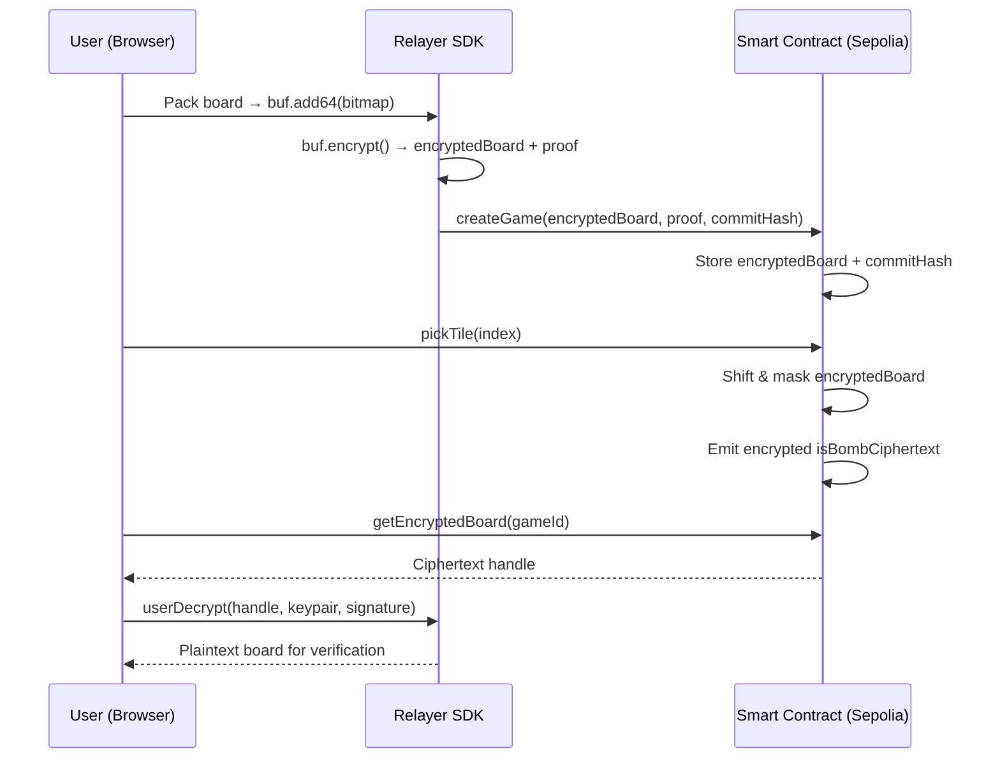

# 📊 Flows & Diagrams — Confidential Bomb

This document explains the key flows and architecture behind **Confidential Bomb**.
It is designed for **beginners**, with simple diagrams showing how FHEVM works in practice.

---

## 🐣 Beginner Onboarding Flow

Refer: [Zama Protocol Overview](https://docs.zama.ai/protocol/protocol/overview)

<p align="center">  
    
</p>  



**Explanation:**
Developers don’t need prior cryptography knowledge.
You just:

* Write contracts like on Ethereum.
* Encrypt inputs before sending.
* Decrypt outputs after receiving.
  The SDK handles all math.

---

## 🎲 Game Flow

This shows the logic of playing **Confidential Bomb** (1 ciphertext per board).



---

## 📌 Deployment Flow

How developers deploy and connect frontend:



---

## 🔄 FHEVM Workflow

This is the generic **encryption → computation → decryption → verification** lifecycle.



---

## 🔐 Frontend Verification Flow

the 3-step process to verify fairness.

```mermaid
graph TD;
    A[User clicks 'Verify'] --> B[Fetch ciphertext from Contract]
    B --> C[User signs EIP-712 message\n(authorize decryption)]
    C --> D[Relayer SDK decrypts ciphertext\nusing user keypair + signature]
    D --> E[Plaintext board shown in UI]
    E --> F[✅ Verified Fairness]
```

**Step-by-step:**

1. **Fetch** → Frontend calls `getEncryptedBoard(gameId)` from contract.
2. **Sign** → User signs EIP-712 message to authorize decryption.
3. **Decrypt** → Relayer SDK decrypts and returns plaintext board.
4. **Verify** → Plaintext board matches commitment → provably fair.

---

## ✅ Summary

* **Game Flow** → how players interact.
* **Deployment Flow** → how devs deploy & connect frontend.
* **FHEVM Workflow** → how encryption/decryption works end-to-end.
* **Frontend Verification Flow** → how fairness is proven without a backend.
