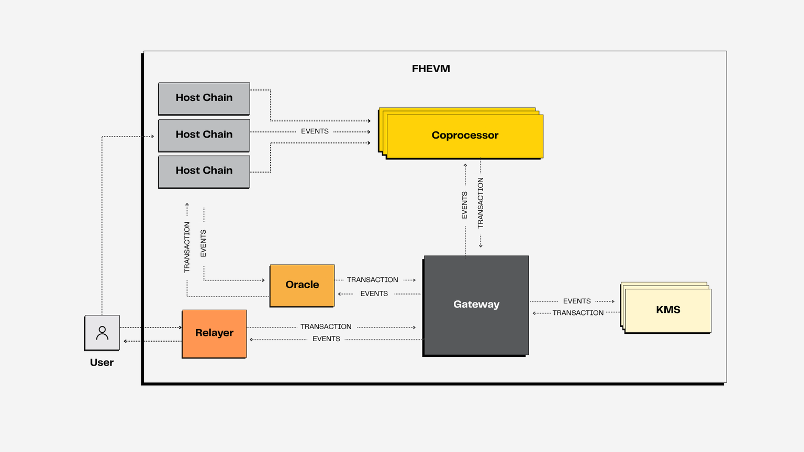
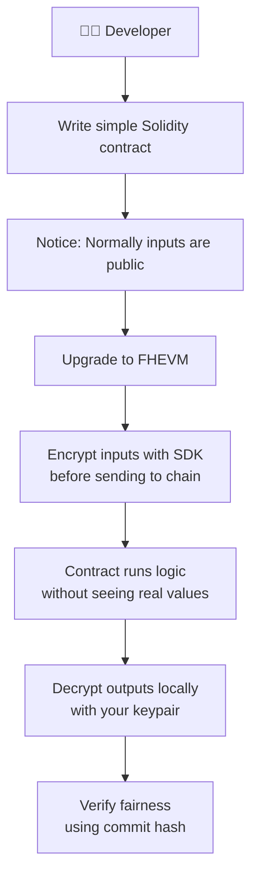
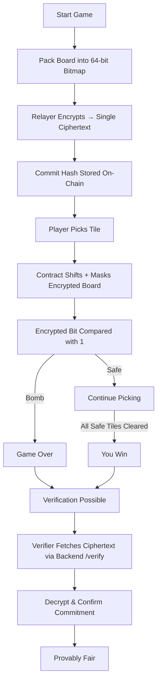
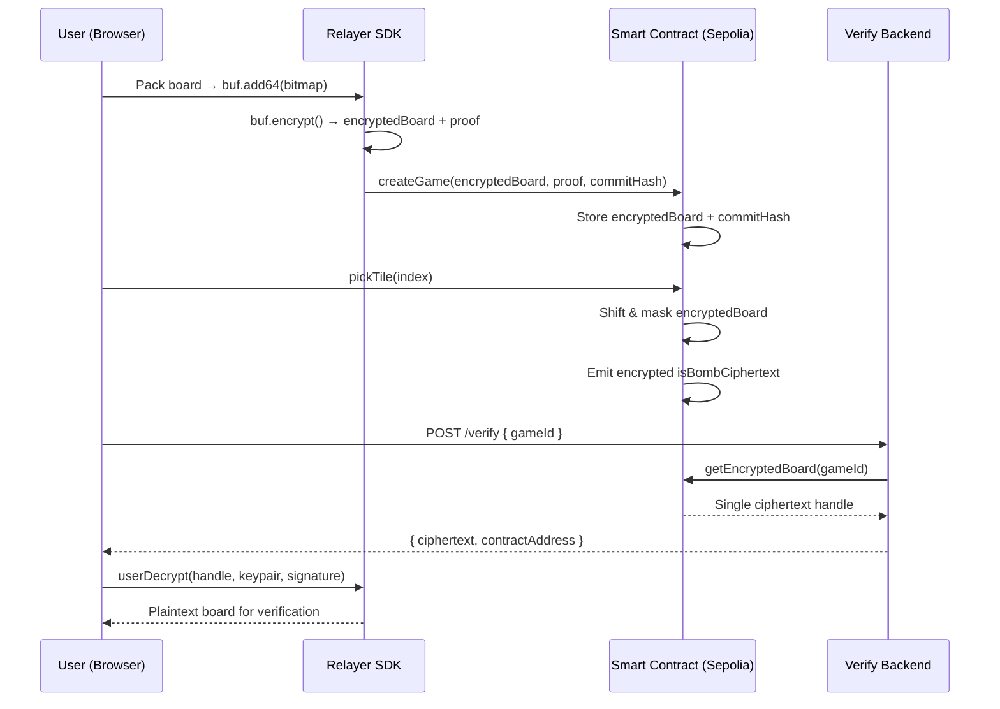

## 🐣 Beginner Onboarding Flow

Refer: https://docs.zama.ai/protocol/protocol/overview

  
    

  

**Explanation:**
This flow is designed for developers who have *no prior knowledge of FHE or cryptography*. You just follow the same steps you already know from building on Ethereum — but add a simple “encrypt before sending” and “decrypt after receiving.” The SDK handles the heavy math, so you can focus entirely on writing and running your dApp.

# 📊 Flows & Diagrams

This document provides visual diagrams that explain the key flows in **Confidential Bomb (1 ciphertext/board mode)**:

* Gameplay logic (for players)
* Deployment steps (for developers)
* FHEVM workflow (encryption → computation → decryption → verification)
* Verification backend workflow

---

## 🎲 Game Flow

---

## 📌 Deployment Flow

---

## 🔄 FHEVM Workflow

---

## 🧐 Verification Backend Workflow

