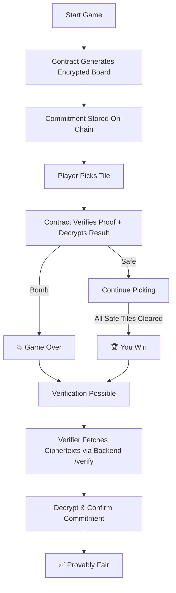
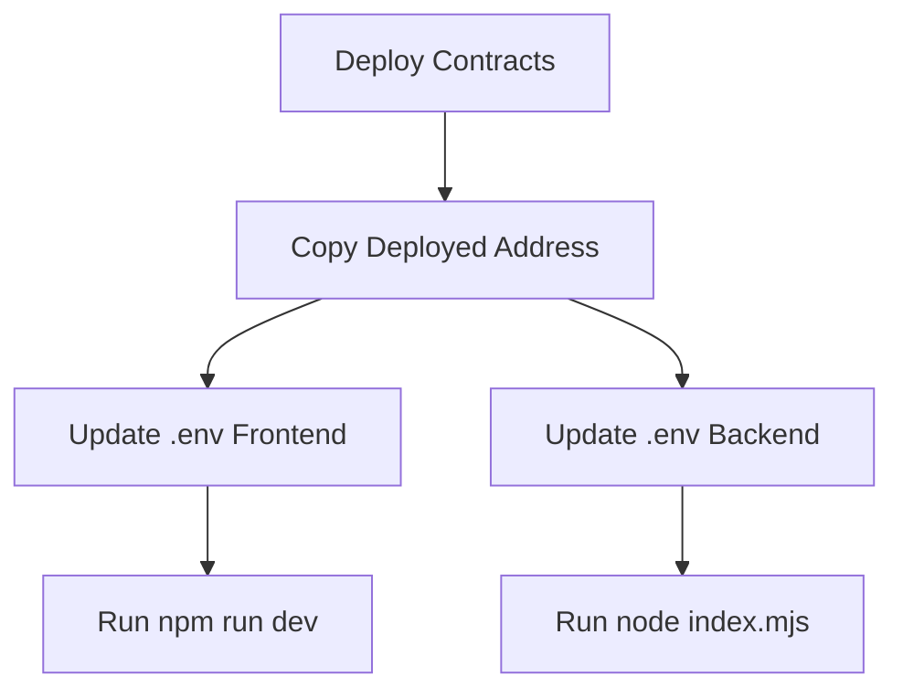
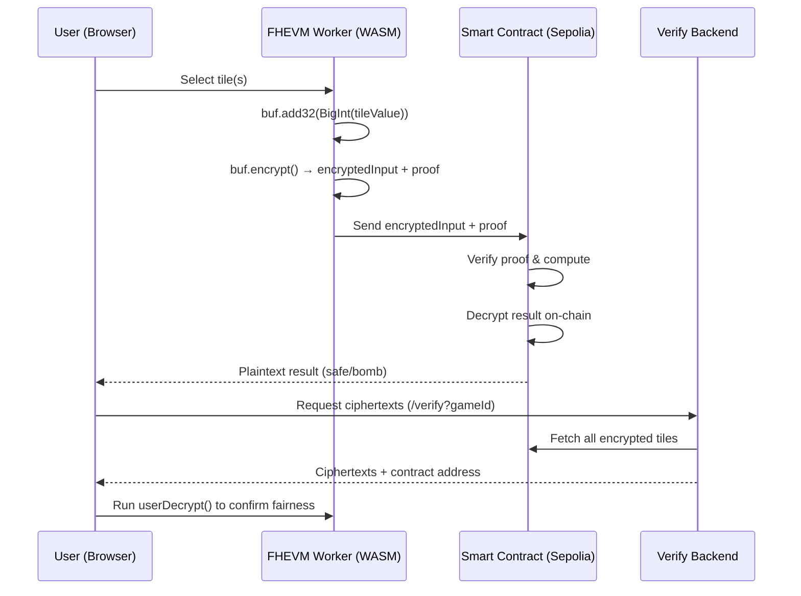
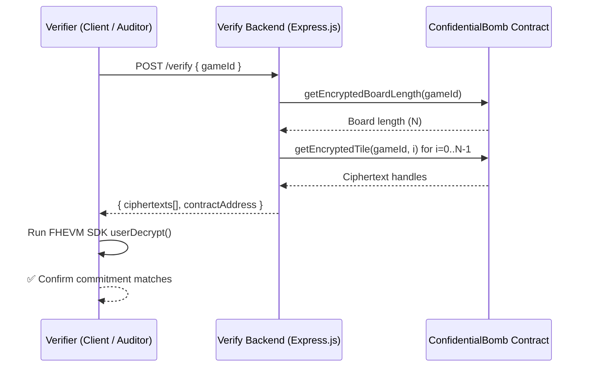

# 📊 Flows & Diagrams

This document provides visual diagrams that explain the key flows in **Confidential Bomb**:

* Gameplay logic (for players)
* Deployment steps (for developers)
* FHEVM workflow (encryption → computation → decryption → verification)
* Verification backend workflow

---

## 🎲 Game Flow (with On-Chain Decrypt)

---

## 📌 Deployment Flow

---

## 🔄 FHEVM Workflow: Encrypt → Compute → Decrypt → Verify

---

## 🧐 Verification Backend Workflow

---

### 🔑 Key Takeaways

* **Backend is stateless** → It only fetches ciphertexts from the contract.
* **Verifier independence** → Anyone can run decryption offline with FHEVM SDK.
* **Provable fairness** → Ensures the game outcome is auditable and transparent.
