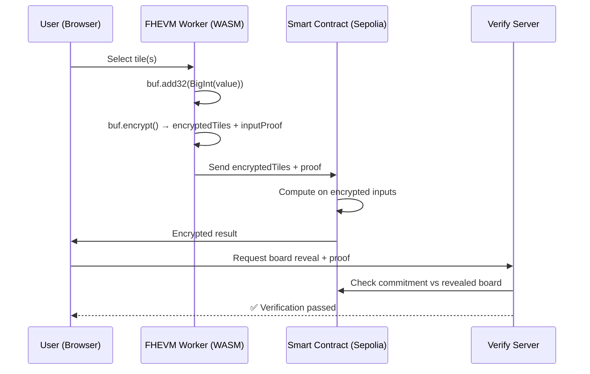

# 📊 Flows & Diagrams

This document provides visual diagrams that explain the key flows in **Confidential Bomb**:  
- Gameplay logic (for players)  
- Deployment steps (for developers)  
- FHEVM workflow (for encryption/computation/decryption)  

---

## 🎲 Game Flow

```mermaid
graph TD;
    A[Start Game] --> B[Random Board Generated & Encrypted]
    B --> C[Commitment Stored On-Chain]
    C --> D[Pick Tiles]
    D -->|Hit Bomb| E[💥 Game Over]
    D -->|Clear All Safe Tiles| F[🏆 You Win]
    F --> G[Reveal Board + Seed]
    G --> H[Verify via Server]
    E --> G
````

---

## 📌 Deployment Flow

```mermaid
graph TD;
    A[Deploy Contracts] --> B[Copy Deployed Address]
    B --> C[Update .env Frontend]
    B --> D[Update .env Backend]
    C --> E[Run npm run dev]
    D --> F[Run node index.mjs]
```

---

## 🔄 FHEVM Workflow: Encrypt → Compute → Decrypt



### Key Takeaways

* **Encrypt:** Done locally in the browser worker → privacy preserved.
* **Compute:** Happens on-chain via FHEVM → no plaintext exposed.
* **Decrypt & Verify:** Only at reveal stage → ensures fairness and provable results.

---

👉 Use this document as a **visual supplement** to the main [README](./README.md).

