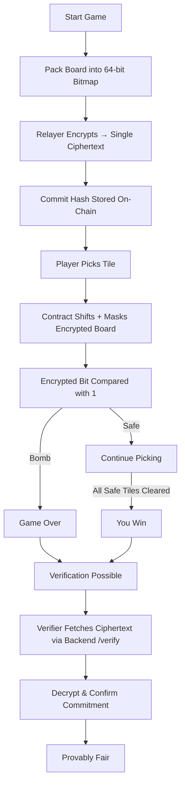
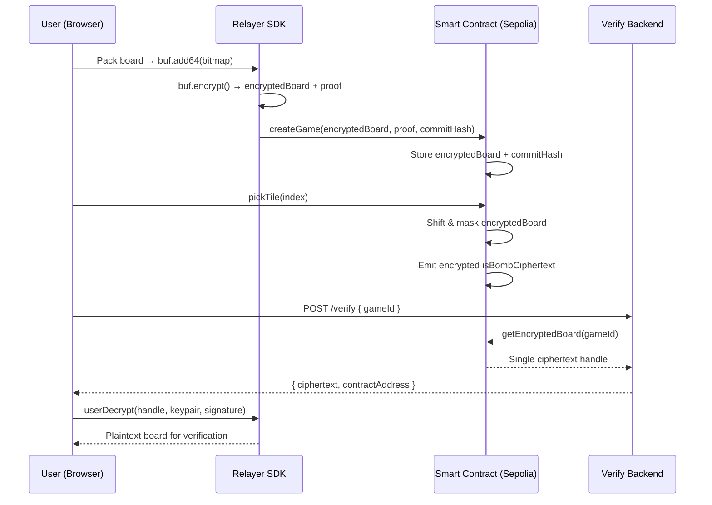
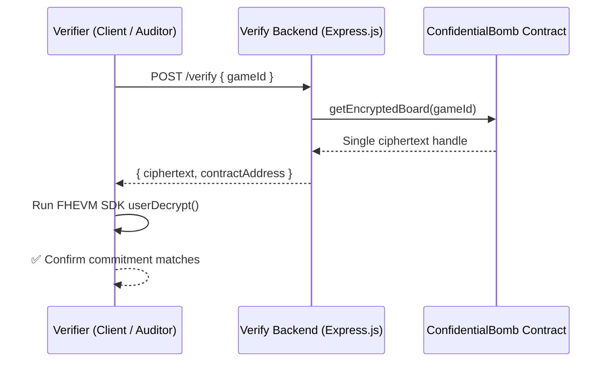

# 📊 Flows & Diagrams

This document provides visual diagrams that explain the key flows in **Confidential Bomb (1 ciphertext/board mode)**:

* Gameplay logic (for players)
* Deployment steps (for developers)
* FHEVM workflow (encryption → computation → decryption → verification)
* Verification backend workflow

---

## 🎲 Game Flow (1 Ciphertext/Board)

---

## 📌 Deployment Flow

---

## 🔄 FHEVM Workflow (New: 1 Ciphertext per Board)

---

## 🧐 Verification Backend Workflow

---

### 🔑 Key Takeaways

* Board is stored as **1 ciphertext** instead of many → faster verification.
* Contract checks tiles by shifting & masking bits.
* Backend is **stateless** → only proxies ciphertext from the contract.
* Any third party can verify game fairness with **FHEVM SDK**.