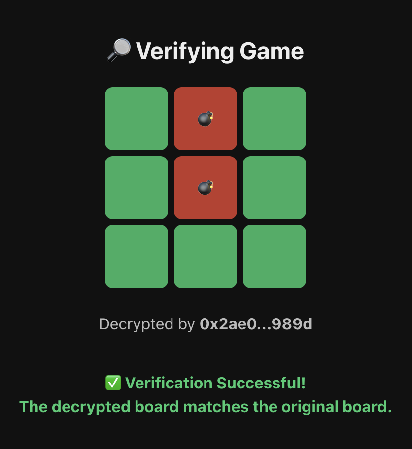

# 💣 Confidential Bomb

A **beginner-friendly blockchain mini-game** powered by [Zama’s FHEVM](https://zama.ai).
Inspired by Minesweeper — **pick safe tiles, dodge bombs, and prove the game is fair**.

> 📝 **Hello FHEVM Tutorial**
> This project is designed as the easiest way to learn and build with **FHEVM**.
> By following this guide, you will:
>
> * Set up a full FHEVM dev environment (Hardhat + frontend + backend).
> * Deploy and interact with your **first confidential smart contract**.
> * Learn the complete flow: **encryption → computation → decryption → verification**.
> * Get inspired to build more advanced confidential dApps.
>
> Think of **Confidential Bomb** as the *“Hello World”* for private Web3 gaming.

<p align="center">  
    
</p>  

---

## 🌐 Demo

* 🎮 Play game → [confidential-bomb.vercel.app](https://confidential-bomb.vercel.app/)
* 🔎 Verify API Endpoint→ [confidential-bomb-verify.vercel.app](https://confidential-bomb-verify.vercel.app/api/verify)
* 📜 Contract deploued → [Sepolia Explorer](https://sepolia.etherscan.io/address/0x65029caA609A1E51F72B8B72c79318f3832255fd)

---

## ✨ Highlights

* 🎮 **Simple gameplay** — choose tiles, avoid bombs.
* 🔐 **Encrypted boards** — bomb positions hidden with **Fully Homomorphic Encryption (FHE)**.
* ✅ **Provably fair** — every move is verifiable on-chain.
* 🌍 **Decentralized** — deployed on Ethereum Sepolia testnet.
* 🦊 **Wallet ready** — connect via MetaMask and play instantly.

---

## 🛠 Tech Stack

* **Smart Contracts** — Solidity + Hardhat
* **Frontend** — React + TypeScript + Ethers.js
* **Encryption/Decryption** — [FHEVM SDK](https://docs.zama.ai/fhevm)
* **Wallet** — MetaMask
* **Network** — Ethereum Sepolia

---

## 🚀 Getting Started

### 📜 Contracts

1. Clone & install:

   ```bash
   git clone https://github.com/phamnhungoctuan/confidential-bomb
   cd contract
   npm install
   ```

2. Set private key:

   ```bash
   npx hardhat vars set PRIVATE_KEY
   ```

3. Compile & test:

   ```bash
   npx hardhat clean && npx hardhat compile
   npx hardhat test
   ```

   Output includes ABI auto-copied to frontend & backend:

   ```
   ✅ ABI copied to frontend/src/abi/ConfidentialBomb.json
   ✅ ABI copied to backend/ConfidentialBomb.json
   ```

4. Deploy locally:

   ```bash
   npx hardhat node
   npx hardhat deploy --network localhost
   ```

5. Deploy to Sepolia:

   ```bash
   npx hardhat deploy --network sepolia
   ```

   Example:

   ```
   ✅ ConfidentialBomb deployed at: 0xYourNewContract
   ```

👉 Copy contract address into `.env` files for frontend & backend.

---

### 🎨 Frontend

1. Install deps:

   ```bash
   cd frontend
   npm install
   ```

2. Add env vars (`.env`):

   ```
   VITE_CONTRACT_ADDRESS=0xYourNewContract
   VITE_VERIFY_SERVER=http://localhost:3001/verify 
   ```

3. Run dev server:

   ```bash
   npm run dev
   ```

   Open: [http://localhost:5174/](http://localhost:5174/)

---

### 🔎 Verify Backend

1. Install deps:

   ```bash
   cd backend
   npm install
   ```

2. Add env vars (`.env`):

   ```
   CONTRACT_ADDRESS=0xYourNewContract
   RPC_URL=https://eth-sepolia.public.blastapi.io
   PORT=3001
   ```

3. Start server:

   ```bash
   node index.mjs
   ```


---

## 🎮 Why FHE in Games?

* Traditional games = **trust the server**.
* With **FHEVM**, encrypted boards are processed and **decrypted directly on-chain**.
* Nobody knows bomb positions until they’re decrypted move by move.
* Ensures **privacy + fairness** → true Web3 gaming.

---

## 🔐 FHEVM in Confidential Bomb

Confidential Bomb uses Zama’s **FHEVM SDK** (WASM worker) to encrypt user moves, while the **contract decrypts results** in real-time.

```js
const buf = fhevm.createEncryptedInput(contractAddress, userAddress);

board.forEach((v) => buf.add32(BigInt(v)));

const result = await buf.encrypt(); // proof for encrypted input
```

And to verify decrypted results:

```js
// Decrypt ciphertexts (handles) from contract
const results = await instance.userDecrypt(
  handleContractPairs,    // encrypted handles from /verify
  keypair.privateKey,     // user private key
  keypair.publicKey,      // user public key
  signature,              // signed authorization
  contractAddresses,      // target contract(s)
  signerAddress,          // address of the signer
  startTimeStamp,         // validity start
  durationDays            // validity duration
);
```

**Strengths**:

* Local encryption in browser (privacy preserved)
* On-chain decryption of results (fairness guaranteed)
* Zero trust required
* Lightweight & scalable

---

## 🧐 Verification Mechanism

Confidential Bomb includes a **Verify Backend** (`backend/index.mjs`) so anyone can independently check game data against the contract.

1. Each move and the final board are **stored as ciphertext handles on-chain**.
2. `/verify` endpoint returns all ciphertexts for a given `gameId`.
3. A verifier can:

   * Fetch ciphertexts.
   * Run decryption with FHEVM SDK.
   * Confirm results match the commitment.

Example:

```http
POST http://localhost:3001/verify
Content-Type: application/json

{ "gameId": 1 }
```

Response:

```json
{
  "ciphertexts": ["0x0ad8...", "0x59f5...", "0xb879..."],
  "contractAddress": "0xYourNewContract"
}
```

<p align="center">  
    
</p>  

Why this matters:

* **Transparency** → Anyone can fetch ciphertexts.
* **No Trust Required** → Backend only proxies contract data.
* **Provable Fairness** → Even if frontend is compromised, results can be verified independently.

---

## 📊 Docs & Diagrams

See [README-flows.md](./README-flows.md) for:

* 🎲 Game flow
* 📌 Deployment flow
* 🔄 FHEVM workflow

---

## ⚡ Performance

* Full board encryption: \~12s on desktop (via worker)
* Optimized with **WebAssembly (WASM)**
* Further speedups possible with:

  * Better WASM builds
  * Parallelization
  * Device-specific benchmarks

---

## 📚 Resources

* [FHEVM Docs](https://docs.zama.ai/fhevm)
* [Zama Discord](https://discord.gg/zama)

---

## ⚠️ Troubleshooting

* **MetaMask won’t connect** → switch to Sepolia testnet
* **RPC errors** → try Alchemy/Infura instead of public RPC
* **Frontend mismatch** → check `.env` contract address
* **Verify fails** → backend `.env` contract mismatch
* **Tx stuck** → increase gas or get more test ETH

---

## 🌟 Credits

Built with ❤️ using **[Zama’s FHEVM](https://zama.ai)**.
Confidential Bomb = **the hello world of private, verifiable Web3 gaming**.

---

## 👤 Contact

* GitHub: [phamnhungoctuan](https://github.com/phamnhungoctuan)
* Twitter: [@tuanphamit](https://x.com/tuanphamit)