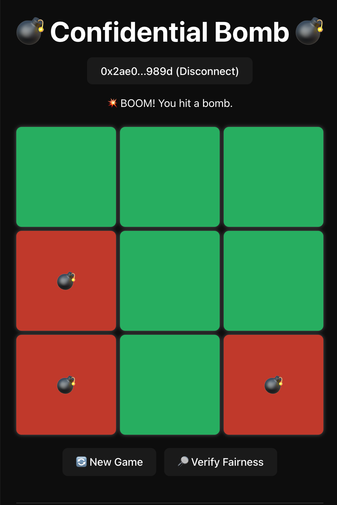

# 💣 Confidential Bomb

A **beginner-friendly blockchain mini-game** powered by [Zama’s FHEVM](https://zama.ai).
Inspired by Minesweeper — **pick safe tiles, dodge bombs, and prove the game is fair**.

Think of **Confidential Bomb** as the *“Hello World”* for private Web3 gaming.
👉 You don’t need cryptography knowledge — if you know how to run a dApp, you can follow along.

<p align="center">  
    
</p>  

---

## 🎯 What You Will Learn

* How to set up a **Hardhat + FHEVM dev environment**
* How to deploy your **first confidential smart contract**
* How to play with an **encrypted board on-chain**
* How to **verify fairness directly in the frontend**

---

## 🌐 Try It First

* 🎮 Play → [confidential-bomb.vercel.app](https://confidential-bomb.vercel.app/)
* 📜 Contract → [Sepolia Explorer](https://sepolia.etherscan.io/address/0x65029caA609A1E51F72B8B72c79318f3832255fd)

---

## ✨ How the Game Works

1. **Start a game** → the contract creates an **encrypted board** (bombs hidden with FHE).
2. **Pick tiles** → contract checks if the tile is safe or a bomb.
3. **Continue** until you hit a bomb or open all safe tiles.
4. **Verify fairness** → frontend fetches ciphertext and uses Zama Relayer to decrypt + prove it matches.

✔ **Simple gameplay** — pick safe tiles, avoid bombs.
✔ **Encrypted board** — bombs hidden using FHE.
✔ **Provably fair** — anyone can verify the board.

---

## 🛠 Tools You’ll Use

* **Smart Contracts** → Solidity + Hardhat
* **Frontend** → React + TypeScript + Ethers.js
* **Encryption** → [FHEVM SDK](https://docs.zama.ai/fhevm)
* **Wallet** → MetaMask
* **Network** → Ethereum Sepolia

---

## 🚀 Getting Started

### Step 1: Setup & Deploy Contract

```bash
git clone https://github.com/phamnhungoctuan/confidential-bomb
cd contract
npm install
```

Set your private key (from MetaMask):

```bash
npx hardhat vars set PRIVATE_KEY
```

Compile + test:

```bash
npm run build:test
```

Deploy to Sepolia:

```bash
npm run deploy
```

👉 After deploy, the script will **auto-update** `frontend/.env` with the new contract address.

---

### Step 2: Run Frontend

```bash
cd frontend
npm install
npm run dev
```

Open: [http://localhost:5174](http://localhost:5174)

🎮 Now you can play the game and click **Verify Fairness** to see proof.

---

## 📊 Learn More

* [README-flows.md](./README-flows.md): diagrams of game flow, deployment flow, FHEVM workflow
* [README-coding.md](./README-coding.md): why 1 ciphertext, why `euint64`, why use a Web Worker
* [README-FHEVM.md](./README-FHEVM.md): background on FHEVM

---

## ⚠️ Troubleshooting

* ❌ MetaMask won’t connect → switch to Sepolia testnet
* ❌ RPC error → try Alchemy/Infura instead of public RPC
* ❌ Verify fails → check `frontend/.env` contract address matches your deployment
* ❌ Tx stuck → add more gas or get Sepolia test ETH

---

## 📚 Resources

* [FHEVM Docs](https://docs.zama.ai/fhevm)
* [Zama Discord](https://discord.gg/zama)

---

## 🌟 Credits

Built with **[Zama’s FHEVM](https://zama.ai)**.
Confidential Bomb = *the hello world of private, verifiable Web3 gaming*.

---

## 👤 Contact

* GitHub: [phamnhungoctuan](https://github.com/phamnhungoctuan)
* Twitter: [@tuanphamit](https://x.com/tuanphamit)