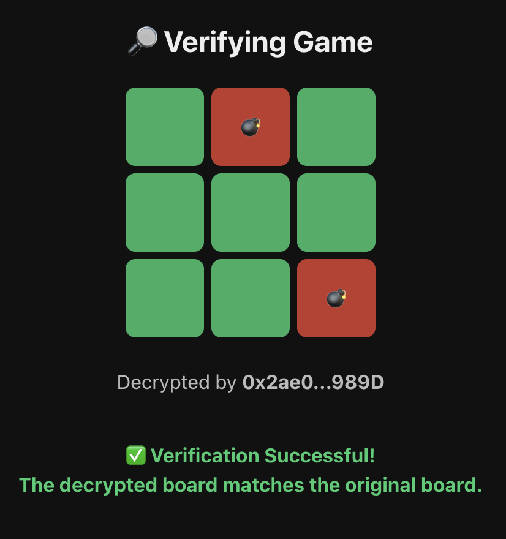

# 💣 Confidential Bomb

A **beginner-friendly blockchain mini-game** powered by [Zama’s FHEVM](https://zama.ai).
Inspired by Minesweeper — **pick safe tiles, dodge bombs, and prove the game is fair**.

> 📝 **Hello FHEVM Tutorial**
> This project is designed as the most beginner-friendly way to learn and build with **FHEVM**.
> By following this guide, any Web3 developer can:
>
> * Set up a full FHEVM dev environment (Hardhat + frontend + backend).
> * Deploy and interact with their **first confidential smart contract**.
> * Learn the complete flow: **encryption → computation → decryption → verification**.
> * Get inspired to build more advanced confidential dApps.
>
> Think of **Confidential Bomb** as the *“Hello World”* for private Web3 gaming.

<p align="center">  
    
</p>  

---

## ✨ Highlights

* 🎮 **Easy to play** — simply choose tiles and avoid bombs.
* 🔐 **Encrypted boards** — bomb positions are hidden with **Fully Homomorphic Encryption (FHE)**.
* ✅ **Provably fair** — every game is committed on-chain and can be verified by anyone.
* 🌍 **Decentralized** — deployed on the Ethereum Sepolia testnet.
* 🦊 **Wallet ready** — connect via MetaMask and play directly.

---

## 🔑 How It Works (Beginner Friendly)

1. **Start a Game**

   * A random 3×3 board with 3 bombs is generated.
   * The board is **encrypted** so even the developer can’t see it.
   * A **commitment** is recorded on-chain.

2. **Pick Tiles**

   * After confirmation, you begin selecting tiles.
   * Hit a bomb → 💥 game over.
   * Clear all safe tiles → 🏆 you win!

3. **Reveal**

   * At the end, the seed and board are revealed.
   * This matches back to the original on-chain commitment, ensuring no cheating.

4. **Verify**

   * Use the **Verify Server** to confirm the revealed board really matches the commitment.

<p align="center">
  
</p>

---

## 🛠 Tech Stack

* **Smart Contracts** — Solidity + Hardhat
* **Frontend** — React + TypeScript + Ethers.js
* **Encryption** — [FHEVM](https://docs.zama.ai/fhevm) by Zama
* **Wallet** — MetaMask
* **Network** — Ethereum Sepolia

---

## 🚀 Getting Started

### Contracts

1. Install dependencies:

   ```bash
   git clone https://github.com/phamnhungoctuan/confidential-bomb
   cd contract
   npm install
   ```

2. Configure environment:

   ```bash
   npx hardhat vars set PRIVATE_KEY
   ```

3. Compile & test:

   ```bash
   npx hardhat clean && npx hardhat compile
   npx hardhat test
   ```

   Example output:

   ```
   ✅ ABI copied to frontend/src/abi/ConfidentialBomb.json
   ✅ ABI copied to backend/ConfidentialBomb.json
   ```

4. Deploy locally:

   ```bash
   npx hardhat node
   npx hardhat deploy --network localhost
   ```

5. Deploy to Sepolia:

   ```bash
   npx hardhat deploy --network sepolia
   ```

   ```
   ✅ ConfidentialBomb deployed at: 0xF3c0256EfaD525415Ad86d7Ba577B05CCC6A52E1
   ```

👉 **Note:** Copy the deployed contract address (e.g. `0xF3c0...`) and update both frontend & backend `.env`.

---

### Frontend

1. Install dependencies:

   ```bash
   cd frontend
   npm install
   ```
2. Copy `.env.example` to `.env`:

   ```
   VITE_CONTRACT_ADDRESS=0xYourContractHere   # replace with deployed address
   VITE_VERIFY_SERVER=http://localhost:3001/verify
   ```

3. Run dev server:

   ```bash
   npm run dev
   ```
4. Open dev server:

   ```bash
   http://localhost:5174/
   ```


---

### Verify Backend

1. Install dependencies:

   ```bash
   cd backend
   npm install
   ```

2. Copy `.env.example` to `.env`:

   ```
    CONTRACT_ADDRESS=0xYourContractHere   # replace with deployed address
    RPC_URL=https://eth-sepolia.public.blastapi.io
    PORT=3001
   ```

3. Start server:

   ```bash
   node index.mjs
   ```


---

## 🌐 Demo

* 🎮 **Play** → [confidential-bomb.vercel.app](https://confidential-bomb.vercel.app/)
* 🔎 **Verify** → [confidential-bomb-verify.vercel.app](https://confidential-bomb-verify.vercel.app/api/verify)
* 📜 **Contract (Sepolia)** → [0xF3c0256EfaD525415Ad86d7Ba577B05CCC6A52E1](https://sepolia.etherscan.io/address/0xF3c0256EfaD525415Ad86d7Ba577B05CCC6A52E1)

---

## 🎮 Why FHE for Games?

* In traditional games, players must **trust the server**.
* With FHEVM, the board stays **encrypted on-chain** while still being playable.
* Nobody knows where bombs are until the reveal.
* This brings both **privacy** and **fairness** — a new standard for Web3 gaming.

---

## 🔐 Why FHEVM Matters in This Project

Confidential Bomb uses Zama’s **FHEVM SDK** inside a Web Worker to encrypt user moves **before they ever touch the blockchain**.

From the worker code:

```js
const buf = fhevm.createEncryptedInput(contractAddress, userAddress);

// Add encrypted values for each tile picked
board.forEach((v) => buf.add32(BigInt(v)));

// Encrypt everything with a single proof
const result = await buf.encrypt();
```

### Key Strengths:

* **Local Encryption** — Tiles are encrypted in the browser (via WASM worker), so no raw game data leaks.
* **Single Proof for All Moves** — `inputProof` lets the contract verify encrypted inputs without revealing them.
* **Zero Trust Needed** — Not even the developer or relayer sees bomb positions or player choices.
* **Scalable & Secure** — Each move is lightweight (`add32` + `encrypt`), making it practical for real games.

---

## 📊 Flows & Diagrams

We’ve prepared a separate document with **all diagrams** for easier understanding:  

- 🎲 Game Flow (player logic)  
- 📌 Deployment Flow (developer setup)  
- 🔄 FHEVM Workflow (encrypt → compute → decrypt)  

👉 [See full diagrams here](./README-flows.md)

## ⚡ Performance Notes

* Current encryption (via worker) for a full board can take **\~14 seconds** on typical hardware:

  ```
  buf.encrypt() worker: 11602 ms
  ```
* This is mainly due to heavy cryptographic operations.
* **WebAssembly (WASM)** is used inside the worker (`importScripts("/fhevm-worker.js")`) to speed up critical math.
* Performance can be further improved by:

  * Using optimized WASM builds from Zama’s SDK.
  * Parallelizing multiple `add32` calls.
  * Running benchmarks per device (desktop vs mobile).

👉 The important part: despite the cost, **encryption always happens client-side**, guaranteeing that game data stays private.

---

## 📚 Resources

* [FHEVM Documentation](https://docs.zama.ai/fhevm)
* [Zama Community Discord](https://discord.gg/zama)

---

## ⚠️ Troubleshooting

* **MetaMask won’t connect** → Make sure you’re on **Sepolia testnet** and have test ETH.
* **RPC errors** → Public Sepolia RPCs can be overloaded; try another endpoint (e.g. Alchemy, Infura).
* **Frontend shows wrong data** → Double-check `.env` has the correct `VITE_CONTRACT_ADDRESS`.
* **Verify server mismatch** → Ensure backend `.env` `CONTRACT_ADDRESS` matches the deployed one.
* **Transaction stuck** → Increase gas or check test ETH balance.

---

## 🌟 Credits

Built with ❤️ on **[Zama’s FHEVM](https://zama.ai)**.

Confidential Bomb isn’t just a mini-game — it’s the **hello world of private, verifiable Web3 gaming**.