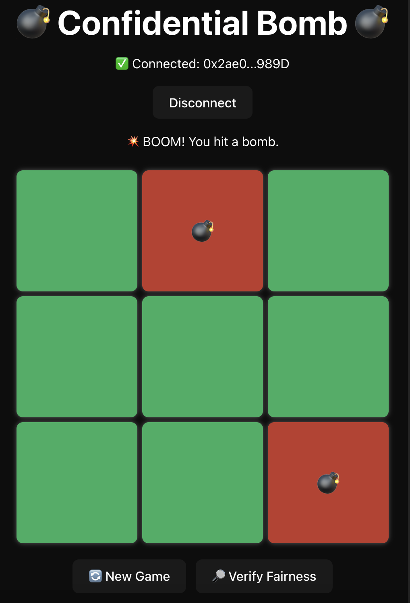

# 💣 Confidential Bomb

A **beginner-friendly blockchain mini-game** powered by [Zama’s FHEVM](https://zama.ai).
Inspired by Minesweeper — **pick safe tiles, dodge bombs, and prove the game is fair**.

Think of **Confidential Bomb** as the *“Hello World”* for private Web3 gaming.
You don’t need cryptography knowledge — if you know how to run a dApp, you can follow along.

<p align="center">  
    
</p>  

---

## 🎯 What You Will Learn

* How to set up a **FHEVM dev environment** (Hardhat + frontend)
* How to deploy your **first confidential smart contract**
* How to interact with an **encrypted board on-chain**
* How to **verify that the game is provably fair** (directly in the frontend)

---

## 🌐 Try It First

* 🎮 Play → [confidential-bomb.vercel.app](https://confidential-bomb.vercel.app/)
* 📜 Contract → [Sepolia Explorer](https://sepolia.etherscan.io/address/0x65029caA609A1E51F72B8B72c79318f3832255fd)

---

## ✨ How the Game Works

1. Start a new game → the contract generates an **encrypted board** (bombs hidden with FHE).
2. Pick tiles → contract checks if it’s safe or a bomb.
3. Keep going until you hit a bomb or open all safe tiles.
4. Verify fairness → the frontend fetches the encrypted board and uses Zama Relayer to decrypt + prove it matches the commitment.

* **Simple gameplay** — pick safe tiles, avoid bombs.
* **Encrypted board** — bomb positions hidden with Fully Homomorphic Encryption.
* **Provably fair** — moves are verifiable on-chain.
---

## 🛠 Tools You’ll Use

* **Smart Contracts** — Solidity + Hardhat
* **Frontend** — React + TypeScript + Ethers.js
* **Encryption** — [FHEVM SDK](https://docs.zama.ai/fhevm)
* **Wallet** — MetaMask
* **Network** — Ethereum Sepolia

---

## 🚀 Getting Started

### Step 1: Contracts

```bash
git clone https://github.com/phamnhungoctuan/confidential-bomb
cd contract
npm install
```

Set private key:

```bash
npx hardhat vars set PRIVATE_KEY
```

Compile & test:

```bash
npx hardhat clean && npx hardhat compile
npx hardhat test
```

➡ ABI will auto-copy to `frontend/src/abi/`.

Run locally:

```bash
npx hardhat node
npx hardhat deploy --network localhost
```

Deploy to Sepolia:

```bash
npx hardhat deploy --network sepolia
```

👉 Copy contract address into `.env` for frontend.

---

### Step 2: Frontend

```bash
cd frontend
npm install
```

Add `.env`:

```
VITE_CONTRACT_ADDRESS=0xYourNewContract
```

Run:

```bash
npm run dev
```

Open: [http://localhost:5174](http://localhost:5174)

📘 Want to learn step by step? → [See Beginner Tutorial](./README-tutorial.md)

---

## 📊 Learn More

* [README-flows.md](./README-flows.md): game flow, deployment flow, FHEVM workflow
* [README-coding.md](./README-coding.md): one ciphertext design, why `euint64`, why use a Web Worker
* [README-FHEVM.md](./README-FHEVM.md): background on FHEVM

---

## ⚠️ Troubleshooting

* ❌ MetaMask won’t connect → switch to Sepolia testnet
* ❌ RPC error → use Alchemy/Infura instead of public RPC
* ❌ Verify fails → check `.env` contract address matches deployment
* ❌ Tx stuck → add gas or get more test ETH

---

## 📚 Resources

* [FHEVM Docs](https://docs.zama.ai/fhevm)
* [Zama Discord](https://discord.gg/zama)

---

## 🌟 Credits

Built with **[Zama’s FHEVM](https://zama.ai)**.
Confidential Bomb = *the hello world of private, verifiable Web3 gaming*.

---

## 👤 Contact

* GitHub: [phamnhungoctuan](https://github.com/phamnhungoctuan)
* Twitter: [@tuanphamit](https://x.com/tuanphamit)